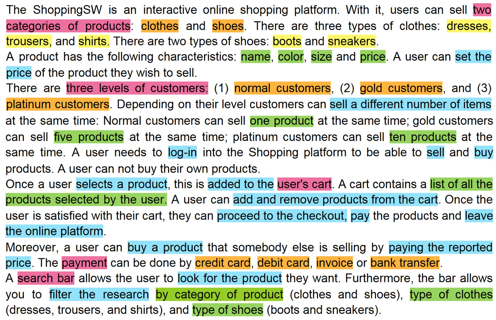
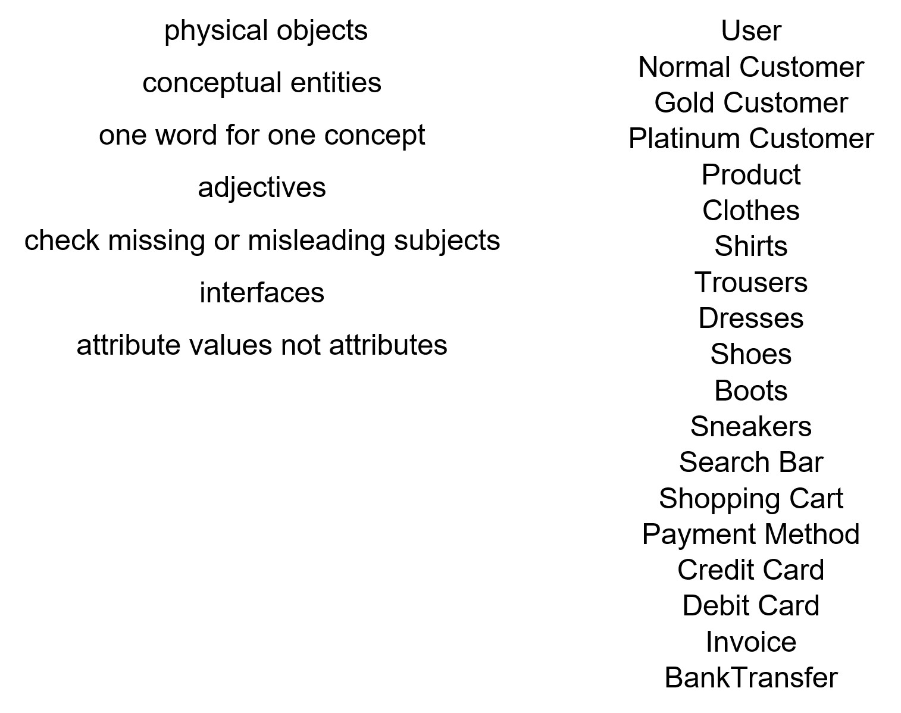
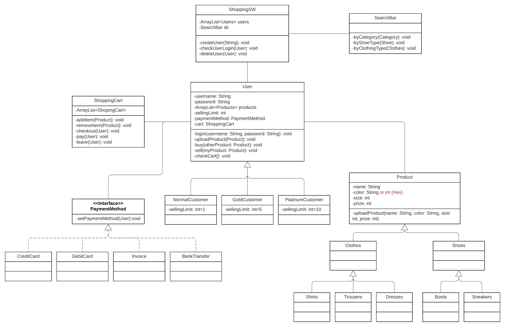

## Software Construction - Assignment 6 Exercise 2  
##### by Stefanie Krohmann, Loris De Luca and Samuele Walzer 

###1. Finding Classes
To find the classes, we went through the text to look for noun phrases. After we identified all of them, we separated them by color to create some sort of hierarchy.
 <b>Color Codes:</b>
 * Pink: 1. Class
 * Orange: 2. Class (Subclass of Pink)
 * Yellow: 3. Class (Subclass of Orange)
 * Green: Parameter
 * Blue: Method
 This resulted in following color-coded text:

###2. Refine to a list of candidate classes
After we found the classes in Part 1, we followed the guidelines from the lecture in order to refine the classes. The guidelines are displayed on the left, our classes on the right:

###3. Put together UML
Based on the first two parts, we now were able to put together the whole UML Class diagram with its dependencies and some possible parameters and methods:

